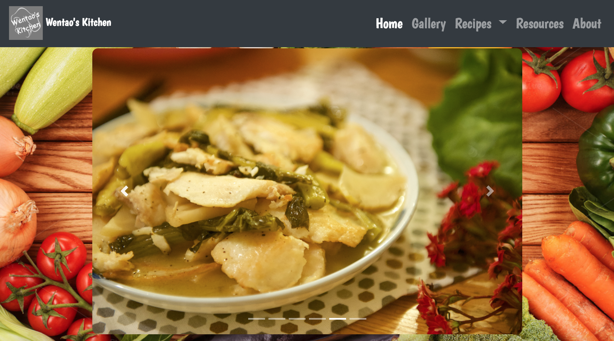
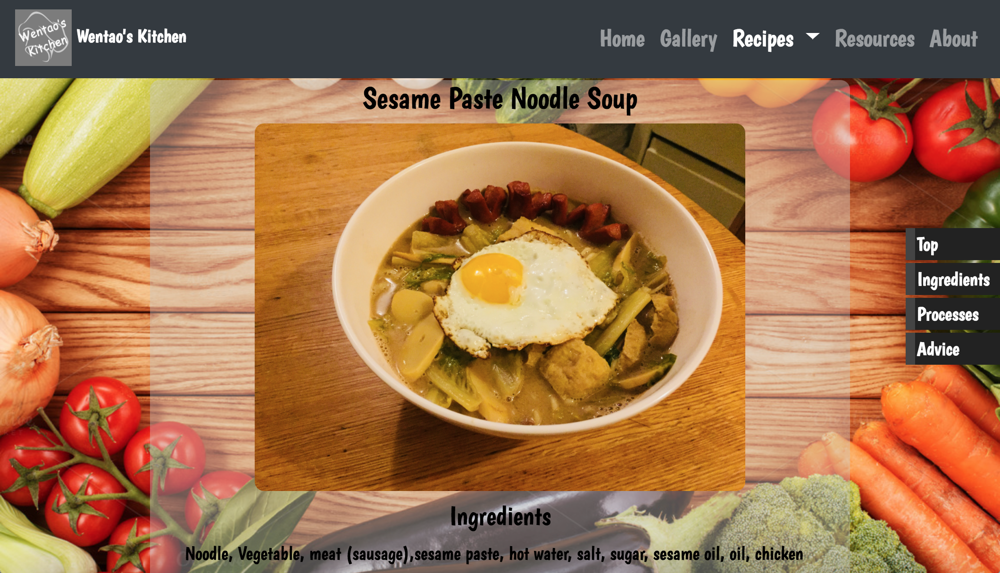
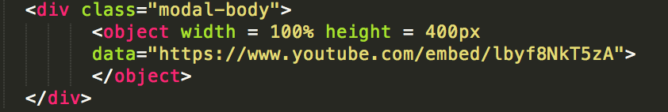
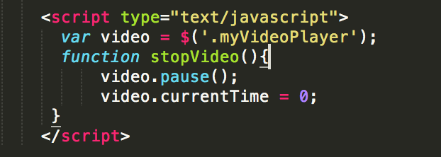
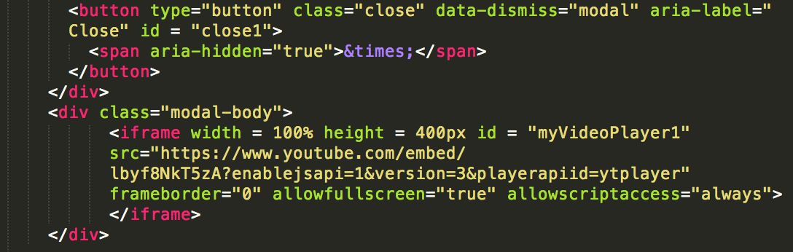
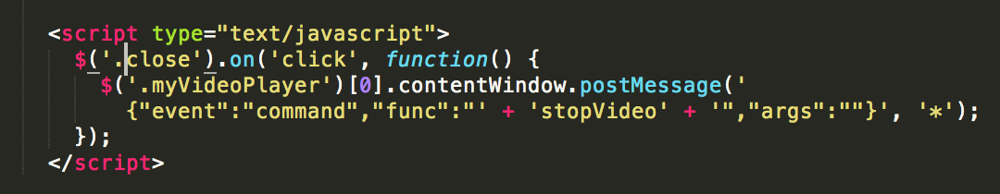
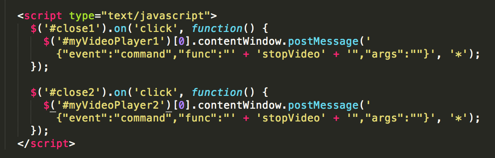

Final Documentation

For my final projecct, I did a website of my own cooking works. It is consisted of a home page, a gallery page, several recipe pages showing some of my recipes, a resourses page, and an about page showing some of my personal information.

This is my home page 

There is a carouse in the middle of hte page, showing images automatically if the cursor is not hovering on it. And by clicking the left and right arrow, it can switch to the image on the left or right. clicking on the bottom bar can also control the image. For this I used bootstrap for making it.

This is my navbar on the top

For the navbar I also used bootstrap, with some of my own customization. I designed my own logo and put it on the top left of the navbar. What's more, there is a dropdowm menu under the recipe tag, leading to different recipe pages.

This is my gallery page

For the gallery page, I used mix-it-up function to make a filter for my gallery. You can click different categoris and the food images will be filterted and sorted accordingly.

This is my recipe page

In the recipe page, the contents are centered in the middle, with images showing the prcesses of food making. A white semi-transparent background on the back is added to make the text more readable to the viewers. A side navbar is used to guide to dfferent part of the page by clicking different buttons.

This is my resourses page

On this page, I presented some further information of some dishes that I would like to recommend to others. There is a learn more button, and clicking it opens up a model showing videos accordingly. 

This is my about page

Some code explaining
I met a problem when I was embedding youtube videos into the model. When I closed the model, the sound track of the video would still be playing. 
This is the origional code for my video player

I tried using html video stopping function, but it turned out that it wouldn't work for youtube videos

Then I did some research online about youtube API and iframe stuff, but I was still confused. Finally I found someone wrote a code that could stop the youtube video by adding some codes at the end of the video link. 

When I added the code, it worked, but only for the first one. I was stucked for a while and finally found out that if I use id to control each individual player instead of using class to write the overall fnuction, it would work for the second one as well.

Some difficulties
1. Conflicting Bootstrap working versions
2. Video won’t stop after closing the model
3. Conflicting usage of tag name (<ul> and <li>)
4. Bootstrap is so good, but difficult to modify in designing

What I learned
1. Always give id or class to different tags when multiple/complicated pages shares the same css/js file. 
2. Enhanced my skill in css code writing.
3. Practiced using Bootstrap to make navbar, modals, buttons, etc.
4. Other codings like jQuery.

Future improvement
1. Polish and fill out some of the space filling content in the website
2. Make the website work better on mobile devices. (one question: how to make the background image fit different size of screens?)
3. Complete the gallery page, make it more like a search engine that link to each individual recipes

My website is https://wangwentao97.github.io

